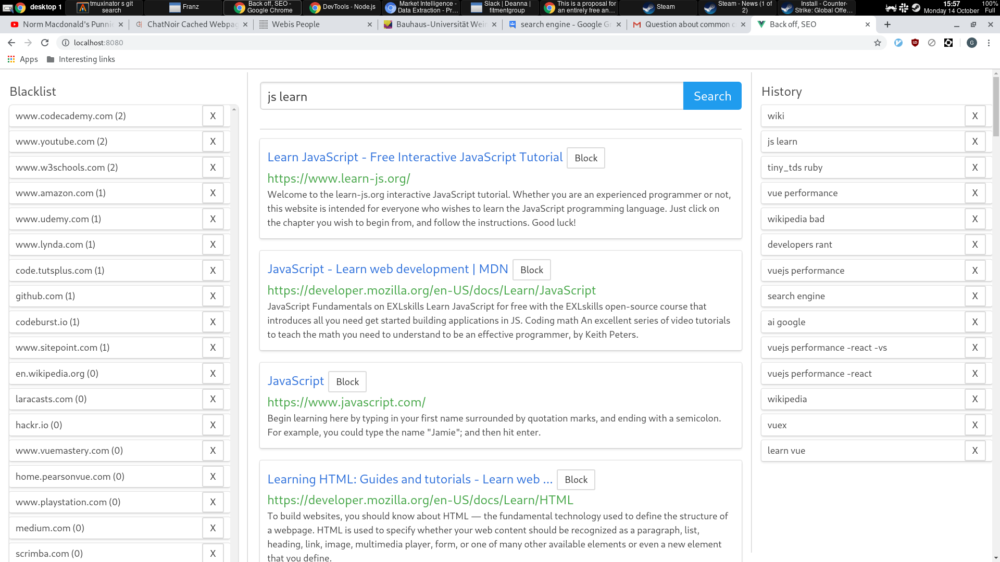

# search

A basic bing based server+web client solution for blocking specific sites.  
Made to dodge advertising based sites that are plaguing the internet.

* Search results are fetched from bing and cached
* The web ui can block requests and replay cached requests

# Requirements

* Node 8 onwards (I'm testing with node 11 and 12 though)
* Mongo
* Bing Web Search API key (sadly non-free, $4 per 1,000 transactions, has a 7 day trial)

## Setup

```
git clone https://github.com/zzyyxxww/search
cd server
yarn // or npm i
cd ..
cd web
yarn // or npm i
```

## Running

server
```
cd server
BING_API=<your_bing_api_here> yarn start // or npm start instead of yarn start
```

web
```
cd web
VUE_APP_SEARCH_API_ADDRESS=http://127.0.0.1:8080 yarn serve // or npm run server instead or yarn serve
```

Then visit url output by web command and this is what the ui should look like (albeit empty):

